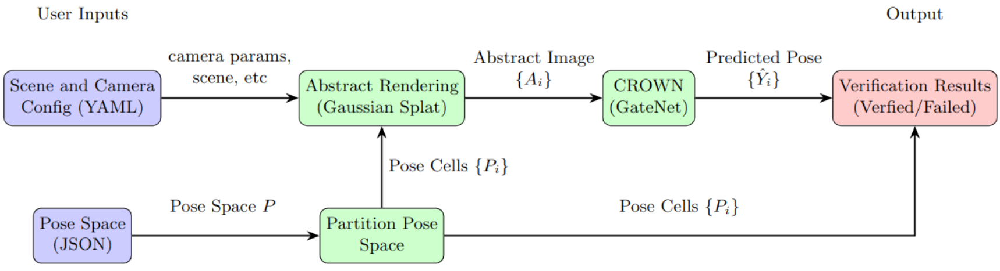

# Abstract-Rendering-Toolkit 

### Authors: Chenxi Ji\* , Yangge Li\* , Xiangru Zhong\* , Huan Zhang, Sayan Mitra

### Updated: Chenxi Ji, chenxij2@illinois.edu, 01/30/2026
This repository provides a user-friendly implementation of **Abstract-Rendering**, which computes the set of images that can be rendered from a set of camera poses under a 3D Gaussian Scene, along with downstream applications such as classification, pose estimation, and object detection.

You can find more resources here:  
- [Paper (NeurIPS 2025)](https://mitras.ece.illinois.edu/research/2025/AbstractRendering_Neurips2025.pdf)  
- [Project Website](https://illinoisreliableautonomygroup.github.io/Abstract-Rendering-Webpage/)  
- [Presentation Slides (NeurIPS 2025)](https://neurips.cc/media/neurips-2025/Slides/119130.pdf)

Follow the steps below to set up the environment, gather scene data, and run the scripts.

---
## Workflow



## Setup

### 0. (Optional) Install Nerfstudio

The scene representation is required to follow the Nerfstudio data format. Therefore, installing Nerfstudio is recommended but not strictly required. You may either follow the installation commands provided in
`
nerfstudio_installation_commands.md
`
or refer to the official [Nerfstudio installation guide](https://docs.nerf.studio/quickstart/installation.html) (note that some steps on the website may be outdated).


### 1. Clone the Abstract-Rendering repository

Download the repository from GitHub:

```bash
cd ~
git clone --branch master https://github.com/IllinoisReliableAutonomyGroup/Abstract-Rendering.git
```

### 2. Install auto_LiRPA
Install the neural network verification library *auto_LiRPA*, and symbolic link it under the Abstract-Rendering dictionary.
```bash
cd ~
git clone --branch master https://github.com/Verified-Intelligence/auto_LiRPA.git
cd ~/Abstract-Rendering
ln -s ~/auto_LiRPA/auto_LiRPA auto_LiRPA
```


### 3. (Optional) Download Scene Data
You may either use your existing Nerfstudio data or download the pre-reconstructed [Nerfstudio scenes](https://drive.google.com/drive/folders/1koY1TL30Bty2x0U6VpszKRgMXk61oTkG?usp=drive_link) and place them in the below dictionary structure.

```bash
~/Abstract-Rendering/nerfstudio/outputs/${case_name}/${reconstruction_method}/${datatime}/...
```

Below is visualization of scene *circle*.


### 4. (Optional) Run via Docker

This repository also includes a Dockerfile that sets up a GPU-enabled environment with CUDA, PyTorch, Nerfstudio, and the other required Python dependencies pre-installed. Using Docker is optional but can make the environment more reproducible and easier to share with others.

- **Prerequisites**: Docker installed on your machine, plus the NVIDIA Container Toolkit if you want to use a GPU from inside the container.
- **Build the image**: From the root of this repository, build a Docker image using the provided Dockerfile, for example under the name `abstract-rendering:latest`:
  ```bash
  cd ~/Abstract-Rendering
  docker build -t abstract-rendering:latest .
  ```
- **Start a container (mount this repo and your local auto_LiRPA)**: Assuming you followed Step 2 to clone auto_LiRPA into `~/auto_LiRPA` and create the symlink in `~/Abstract-Rendering`, run:
  ```bash
  cd ~/Abstract-Rendering
  docker run --gpus all -it --rm \
    -v "$HOME/Abstract-Rendering":/workspace/Abstract-Rendering \
    -v "$HOME/auto_LiRPA":"$HOME/auto_LiRPA" \
    abstract-rendering:latest \
    /bin/bash
  ```
  The first `-v` makes your local Abstract-Rendering repository visible at `/workspace/Abstract-Rendering` inside the container. The second `-v` mounts your `~/auto_LiRPA` clone at the same absolute path inside the container so that the `auto_LiRPA` symlink in this repo continues to resolve and the code uses your local auto_LiRPA version.
- **Inside the container**: Once the container starts, run
  ```bash
  cd /workspace/Abstract-Rendering
  ```
  and you can follow the commands in the *Examples* section below exactly as written to run the rendering, abstract rendering, and downstream verification scripts from inside the container.

## Examples

**Note**: The default GPU memory is 16GB. If you machine has less, please reduce the value of `gs_batch` in `config.yaml`.

---
### Normal Rendering
You can use the command below to render images from a specified set of waypoints in a given scene (e.g. *circle*):
```bash
cd ~/Abstract-Rendering
export case_name=mini_line
python3 scripts/render_gsplat.py --config configs/${case_name}/config.yaml --odd configs/${case_name}/samples.json
```

The rendered image (`ref_######.png`) will be saved under `~/Abstract-Rendering/Outputs/RenderedIamges/${case_name}/${odd_type}`, for example:


### Abstract Rendering
You can use the command below to generate abstract images from a specified set of waypoints in a given scene (e.g. *circle*):
```bash
cd ~/Abstract-Rendering
export case_name=mini_line
python3 scripts/abstract_gsplat.py --config configs/${case_name}/config.yaml --odd configs/${case_name}/traj.json
```

The rendered images (`abstract_######.pt`) will be saved under 
`~/Abstract-Rendering/Outputs/AbstractIamges/${case_name}/${odd_type}`, and can be visualized by command, (e.g. *circle*):

```bash
cd ~/Abstract-Rendering
export case_name=mini_line
python3 scripts/vis_absimg.py --config configs/${case_name}/vis_absimg.yaml
```

The visualization of abstract image would be like 

where the top-left subfigure shows sample concrete image from the pose cell; the bottom-left/right subfigure shows lower/upper bound abstract images; the top-right subfigure shows per-pixel difference between bounds as a heatmap.


### Train Gatenet
```bash
cd ~/Abstract-Rendering
export case_name=mini_line
python3 scripts/train_gatenet.py --config configs/${case_name}/gatenet.yml --samples configs/${case_name}/samples.json
```

### Certify Gatenet
```bash
cd ~/Abstract-Rendering
export case_name=mini_line
python3 scripts/certify_gatenet.py --config configs/${case_name}/gatenet.yml
```

### Visualize Certification Results
```bash
cd ~/Abstract-Rendering
export case_name=mini_line
python3 scripts/plot_gatenet.py --config configs/${case_name}/gatenet.yml --traj configs/${case_name}/traj.yaml
```

The visualization of Gatenet Verification is like:


where green indicates certified regions; red denotes potential
violations; blue indicates gates.

## Scripts
`render_gsplat.py`:

`render_gsplat.py`:
- Concrete renderer: given a trained Nerfstudio 3D Gaussian scene and a list of poses, it produces standard RGB images along the trajectory.
- Reads `configs/${case_name}/config.yaml` for parameters set by the user and `configs/${case_name}/traj.json` for the pose information.
- Key parameters in `config.yaml`:
  - Scene selection (`render_method`, `case_name`, `data_time`, `checkpoint_filename`): must match the Nerfstudio output you want to render; use the same format for saving the nerfstudio outputs as mentioned above.
  - Resolution vs speed (`width`, `height`, `fx`, `fy`, `downsampling_ratio`): start with the Nerfstudio training values; if rendering is slow or hits GPU memory limits, increase `downsampling_ratio` to render smaller images while keeping intrinsics consistent.
  - Visible depth range (`min_distance`, `max_distance`): if nearby objects are clipped, reduce `min_distance`; if far background clutter dominates, reduce `max_distance`.
  - Memory/performance (`tile_size_render`, `gs_batch`):These can be adjusted based on available GPUs.
  - Background and saving (`bg_img_path` vs `bg_pure_color`, `save_ref`, `save_filename`): choose between a solid background color or an image, and whether/where to save results.
- Output: for each pose in `traj.json`, renders RGB images to `Outputs/RenderedImages/${case_name}/${odd_type}/`.

`abstract_gsplat.py`:
- Abstract renderer: It takes a *linear set* of perturbed poses around a segment of the trajectory and uses auto_LiRPA to propagate that pose uncertainty through the Gaussian splatting renderer, producing for each pixel a certified lower/upper bound (min/max) over all poses in the set.
- Uses the same `configs/${case_name}/config.yaml` and `configs/${case_name}/traj.json` as `render_gsplat.py`.
- Additional `config.yaml` parameters you will tune:
  - `odd_type`: currently `"cylinder"`, meaning the perturbation set is a cylinder around the nominal path between two waypoints.
  - `tile_size_abstract`: tile size for pixels for the abstract renderer; tuned based on GPU memory.
  - `part`: a triplet describing how finely you partition the cylinder (roughly radial / angular / along‑trajectory). Larger values → more cells, tighter bounds, longer computation; smaller values → fewer cells, looser bounds, quicker computation.
  - `save_bound`: if `true`, saves the lower/upper bound images for each pose cell.
  - `N_samples`: number of concrete samples drawn inside each cell when you want example concrete images in addition to the bounds.
- For each consecutive pair of waypoints in `traj.json`, builds the corresponding cylindrical perturbation set, partitions it according to `part`, and then uses `TransferModel + GsplatRGB` wrapped by auto_LiRPA to compute and save abstract records (with per‑pixel min/max) under `Outputs/AbstractImages/${case_name}/${odd_type}/`.

`render_models.py`:
- The rendering back‑end that both concrete and abstract pipelines rely on:
  - `TransferModel`: a wrapper that holds the current camera rotation and base translation (and, for abstract rendering, also the cylinder direction and radius describing the pose cell). Given either a concrete pose or abstract cylinder parameters, it uses `utils_transform.py` to build a full camera pose matrix and then calls the underlying renderer.
  - `GsplatRGBOrigin`: the concrete renderer used by `render_gsplat.py`. It takes Nerfstudio’s Gaussian parameters (means, scales, opacities, colors), preprocesses them once, and for each pose and image tile projects the Gaussians into that tile and alpha‑blends their colors according to the Gaussian splatting algorithm to produce an RGB tile.
  - `GsplatRGB`: the abstract renderer used by `abstract_gsplat.py`. It implements the same splatting idea as `GsplatRGBOrigin`, but is structured for abstract rendering: for a given pose and tile it (i) crops to only Gaussians that can affect that tile, (ii) splits them into batches controlled by `gs_batch` to fit in memory, and (iii) exposes per‑tile alpha and color tensors that encode each Gaussian’s contribution to each pixel. When `TransferModel(GsplatRGB, ...)` is evaluated under auto_LiRPA with a pose cell as input, these tensors become functions of the abstract input; `utils_alpha_blending.py` then performs interval alpha blending on their LiRPA bounds to obtain per‑pixel lower/upper color bounds over all poses in the perturbation set.

`utils_transform.py`:
- Handles all camera and scene coordinate conversions.
- Builds view matrices from translations and rotations, applies the Nerfstudio world transform and scale, and converts camera‑to‑world transforms into the world‑to‑camera form.
- Also provides the cylindrical pose representation used to describe paths and pose cells in abstract rendering (e.g., mapping abstract cylinder coordinates to concrete translations).

`utils_alpha_blending.py`:
- Implements the volume‑rendering step for Gaussian splats.
- For each gaussian, combines opacity and color contributions for each pixel ray using a cumulative product, and extends the same logic to lower/upper bounds in the abstract setting via interval alpha blending.

**Configuration and new cases**:
- Each case (e.g., `circle`, `line`, `uturn`, `mini_line`) has its own subfolder under `configs/` (such as `configs/circle/`) containing at least:
  - `config.yaml`: shared configuration for `render_gsplat.py` and `abstract_gsplat.py` as described above.
  - `traj.yaml` / `traj.json`: trajectory configuration and generated waypoint/pose file.
  - Optional downstream configs such as `gatenet.yml` and `vis_absimg.yaml`.
- When creating a new case, you should create a new folder under `configs/` (for example `configs/my_case/`) and add a new `config.yaml` and trajectory files there, rather than modifying the existing case folders.

- Implements the volume‑rendering step for Gaussian splats.
- For each gaussian, combines opacity and color contributions for each pixel ray using a cumulative product, and extends the same logic to lower/upper bounds in the abstract setting.


## Citation

If you use this repository or the Abstract-Rendering toolkit in your work, please consider citing our NeurIPS 2025 splotlight poster:

**BibTeX:**
```bibtex
@inproceedings{ji2025abstractrendering,
  title     = {Abstract Rendering: Certified Rendering Under 3D Semantic Uncertainty},
  author    = {Ji, Chenxi and Li, Yangge and Zhong, Xiangru and Zhang, Huan and Mitra, Sayan},
  booktitle = {Advances in Neural Information Processing Systems (NeurIPS) 2025},
  year      = {2025},
  note      = {Poster},
  url       = {https://mitras.ece.illinois.edu/research/2025/AbstractRendering_Neurips2025.pdf}
}